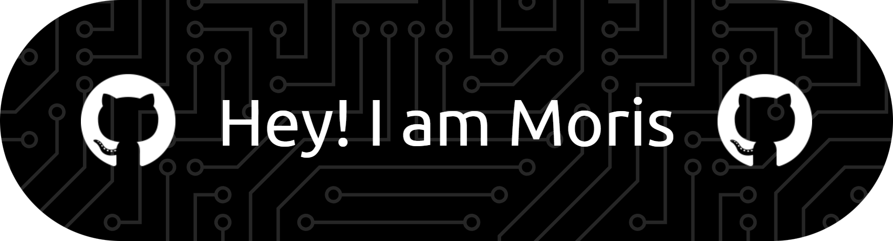

<!--  -->
# Hi, I'm Moris 👋
-------------------------------------------------------------------------
<!--
**Morissarkol/Morissarkol** is a ✨ _special_ ✨ repository because its `README.md` (this file) appears on your GitHub profile.

Here are some ideas to get you started:

- 🔭 I’m currently working on ...
- 🌱 I’m currently learning ...
- 👯 I’m looking to collaborate on ...
- 🤔 I’m looking for help with ...
- 💬 Ask me about ...
- 📫 How to reach me: ...
- 😄 Pronouns: ...
- ⚡ Fun fact: ...
-->

- 🔭 I’m currently seeking new opportunities to grow and contribute in the IT field.
- 🌱 I’m currently learning **Laravel** dan **JavaFX** Framework
- 😁😁😁😁

##### Skill

 Github Stats 👌

